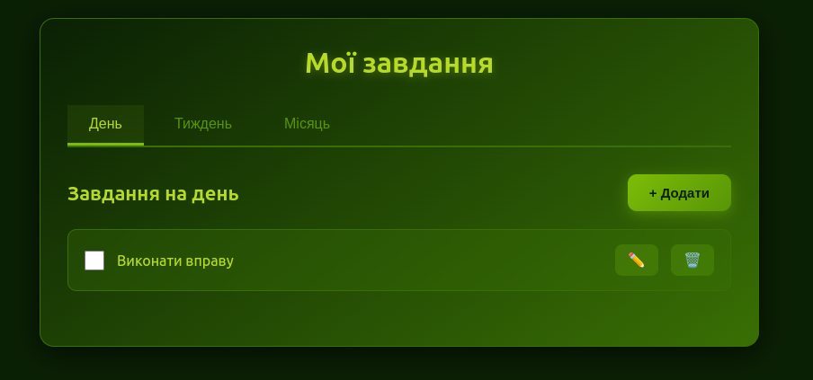

# Todo App (Electron)

Простой планировщик задач на день, неделю и месяц с поддержкой нескольких языков (i18n).  

## Возможности

- Вкладки: День / Неделя / Месяц
- Добавление, редактирование и удаление задач
- Сохранение задач в локальный файл `tasks.json`
- Переключение языков (Українська, Русский, English)
- Модальное окно для ввода и редактирования задач
- Кнопка выхода из приложения

## Скриншоты



## Установка

1. Клонировать репозиторий:

```bash
git clone <URL_репозитория>
cd todo-app
